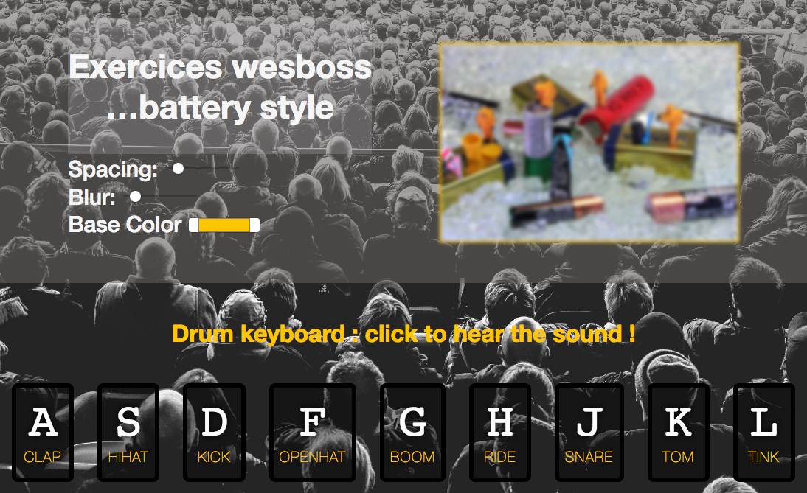

# Drums-keyboard
Selection de deux exercices basés sur les <a href="https://javascript30.com/"> Wesbos challenge </a>  

• Appliquer des personnalisation à une image en bougeant les curseurs : on met à jour le CSS3 en temps réel avec le javascript.
 
• Jouer des sons en appuyant sur les touches de son clavier. Les neufs touches centrales du clavier de l'ordinateurs font office de mixette pour émettre des sons.
 

